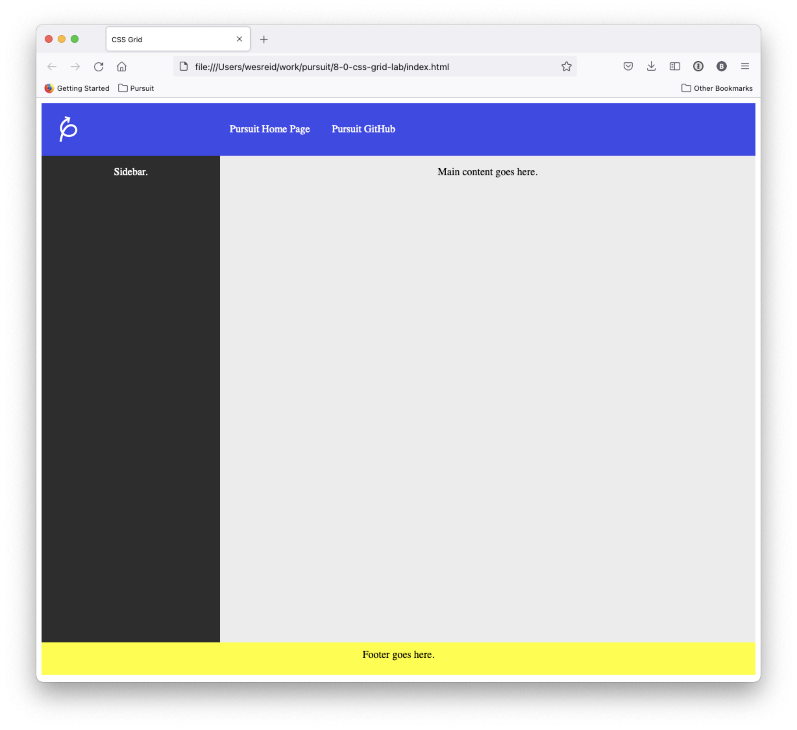

# CSS Grid Lab

In this lab, you will use CSS Grid to structure a webpage. If you're stuck, you may want to visit the following website which can be of help.

- [CSS-Tricks: A Complete Guide to Grid](https://css-tricks.com/snippets/css/complete-guide-grid/)

## Lab Setup

### Getting started

1. Fork and clone this repository.

1. Navigate to the `settings` tab on GitHub, then choose `Pages` from the menu. Configure the `Build and Deployment` to have a `Source` of `Deploy from a branch` and select the `main` branch for deployment. Deployments can take a few minutes, so get started on the lab, and then be sure to check the deployment after you have made a few commits.

1. Open up the repository in VSCode. Follow the instructions below to complete the Lab.

## Instructions

Style the HTML in the `index.html` file so that it looks like the content below.

You _should not_ need to change any of the HTML. Instead, focus on adding to the `style.css` file.

Use CSS Grid when organizing the content on the page.
